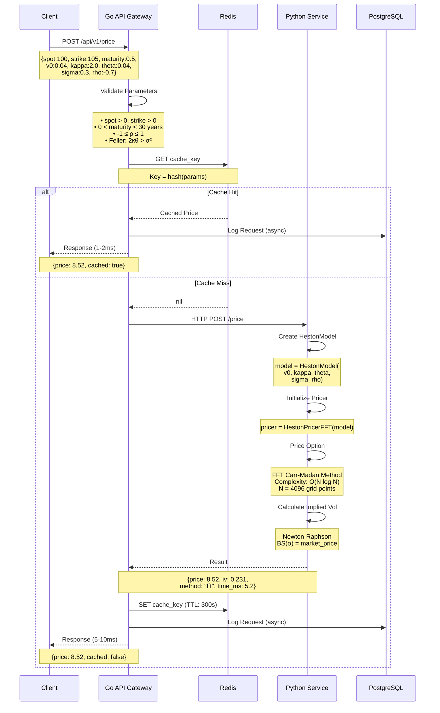
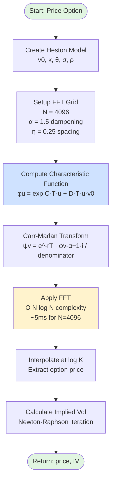
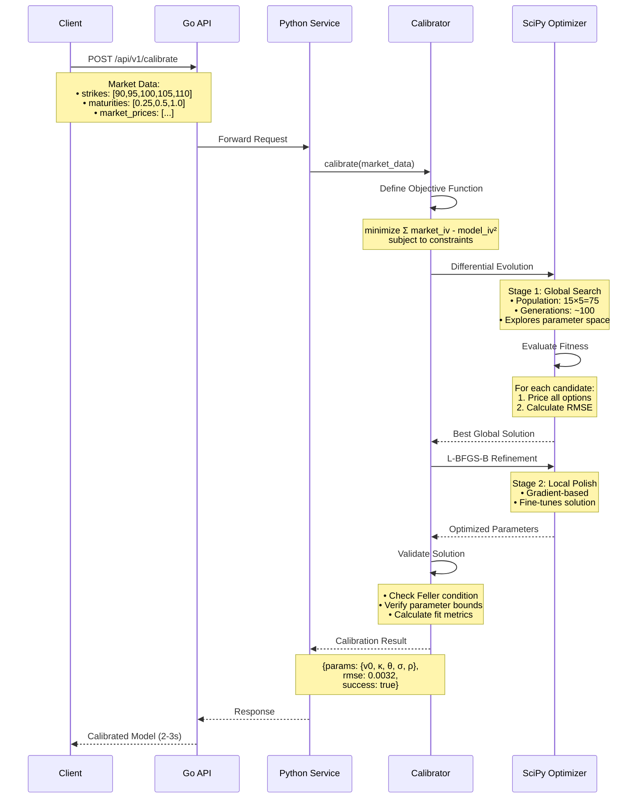
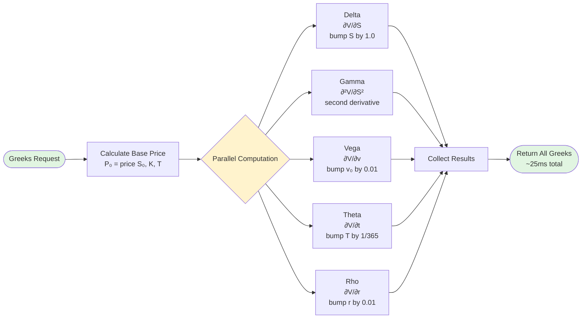

# Heston Options Pricing Engine

A production-ready options pricing system implementing the Heston stochastic volatility model. This project demonstrates advanced pricing algorithms, model calibration, and full-stack microservices architecture.

[](https://www.python.org/)
[](https://golang.org/)
[](LICENSE)

---

## Table of Contents

- [Why This Project](#why-this-project)
- [What is the Heston Model](#what-is-the-heston-model)
- [System Architecture](#system-architecture)
- [How It Works](#how-it-works)
- [Key Features](#key-features)
- [Performance Metrics](#performance-metrics)
- [Quick Start](#quick-start)
- [API Documentation](#api-documentation)
- [Python Library Usage](#python-library-usage)
- [Project Structure](#project-structure)
- [Technologies](#technologies)
- [References](#references)

---

## Why This Project

### The Problem with Black-Scholes

Black-Scholes assumes **constant volatility**, but real markets exhibit:

| Market Phenomenon | Observation | Impact |
|-------------------|-------------|--------|
| **Volatility Smile** | OTM options trade at higher IVs than ATM | Mispricing of wings |
| **Volatility Skew** | Puts have higher IV than calls (especially equity markets) | Crash protection premium |
| **Term Structure** | Short-dated options behave differently than long-dated | Time-varying risk |

### The Solution: Stochastic Volatility

The **Heston model** treats volatility as a random process, capturing these market dynamics that Black-Scholes misses. This is crucial for:

- Market makers hedging volatility risk
- Exotic options pricing (barriers, Asians, etc.)
- Risk management (VaR, CVaR)
- Proprietary trading strategies

---

## What is the Heston Model

### The Mathematics

The Heston (1993) model describes joint evolution of stock price and variance:

```
Stock Price:    dS(t) = r·S·dt + √v(t)·S·dW₁
Variance:       dv(t) = κ(θ - v(t))dt + σ√v(t)·dW₂

Correlation:    corr(dW₁, dW₂) = ρ
```

### Parameters Explained

| Parameter | Symbol | Meaning | Typical Range | Market Intuition |
|-----------|--------|---------|---------------|------------------|
| Initial Variance | v₀ | Current market variance | 0.01 - 0.10 | Spot vol squared (20% vol → v₀=0.04) |
| Mean Reversion | κ | Speed of reversion to θ | 0.5 - 5.0 | How fast vol returns to average |
| Long-term Variance | θ | Equilibrium variance | 0.01 - 0.10 | Long-run average volatility |
| Vol of Vol | σ | Volatility of variance | 0.1 - 1.0 | How much vol itself moves |
| Correlation | ρ | Price-vol correlation | -0.9 to -0.5 | Leverage effect (negative for equities) |

### Why Negative Correlation?

**Leverage Effect:** When stock prices ↓, volatility ↑ 
- Companies become riskier (higher debt/equity)
- Creates the **volatility skew** (OTM puts expensive)
- Typical for equity markets: ρ ≈ -0.7

---

## System Architecture

### High-Level Architecture

```
┌────────────────────────────────────────────────────────────────────┐
│                          Client Layer                              │
│         (REST API, Python Library, Jupyter Notebooks)              │
└───────────────────────────────┬────────────────────────────────────┘
                                │
                                ▼
┌────────────────────────────────────────────────────────────────────┐
│                    Go API Gateway (:8080)                          │
│  ┌──────────────────────────────────────────────────────────────┐ │
│  │  • Request Validation & Parsing                              │ │
│  │  • Redis Caching Layer (5min TTL)                            │ │
│  │  • Rate Limiting & Authentication                            │ │
│  │  • Prometheus Metrics Export                                 │ │
│  │  • Request Routing & Load Balancing                          │ │
│  └──────────────────────────────────────────────────────────────┘ │
└───────────────┬────────────────────────────────┬───────────────────┘
                │                                │
                ▼                                ▼
┌───────────────────────────┐      ┌────────────────────────────────┐
│   Redis Cache             │      │  Python Pricing Service        │
│   • Hot price cache       │      │        (:5000)                 │
│   • Greeks cache          │      │  ┌──────────────────────────┐ │
│   • 5-minute TTL          │      │  │  Heston Pricing Engine   │ │
│   • LRU eviction          │      │  │  ┌────────────────────┐  │ │
└───────────────────────────┘      │  │  │ FFT Pricer         │  │ │
                                   │  │  │ (Carr-Madan)       │  │ │
┌───────────────────────────┐      │  │  │ ~5ms per option    │  │ │
│   PostgreSQL Database     │      │  │  └────────────────────┘  │ │
│   • Request logs          │      │  │  ┌────────────────────┐  │ │
│   • Pricing history       │      │  │  │ Monte Carlo Pricer │  │ │
│   • Calibration results   │      │  │  │ ~1s per option     │  │ │
│   • Audit trail           │      │  │  └────────────────────┘  │ │
└───────────────────────────┘      │  │  ┌────────────────────┐  │ │
                                   │  │  │ Calibrator         │  │ │
                                   │  │  │ (DE + L-BFGS-B)    │  │ │
                                   │  │  │ ~2-3s for 50 opts  │  │ │
                                   │  │  └────────────────────┘  │ │
                                   │  │  ┌────────────────────┐  │ │
                                   │  │  │ Greeks Calculator  │  │ │
                                   │  │  │ ~25ms all Greeks   │  │ │
                                   │  │  └────────────────────┘  │ │
                                   │  └──────────────────────────┘ │
                                   └────────────────────────────────┘
```

### Component Responsibilities

| Component | Purpose | Technology |
|-----------|---------|------------|
| **Go API Gateway** | High-performance entry point, caching, metrics | Go 1.21, gorilla/mux |
| **Python Pricing Service** | Core pricing logic, numerical computing | Python 3.9, NumPy, SciPy |
| **Redis** | Sub-millisecond caching, reduces compute load | Redis 7 |
| **PostgreSQL** | Persistent storage, analytics, audit | PostgreSQL 15 |

---

## How It Works

### Option Pricing Flow



### FFT Pricing (Carr-Madan Method)

The core pricing algorithm uses Fourier transform for speed:



### Model Calibration Flow



### Greeks Calculation



---

## Key Features

### 1. Dual Pricing Methods

#### FFT (Carr-Madan) - Primary Method
- **Algorithm**: Fourier transform of characteristic function
- **Complexity**: O(N log N), N=4096
- **Speed**: ~5ms per option, ~50ms for 50 options
- **Use Case**: Real-time pricing, market making

**How it works:**
```python
# Characteristic function
phi(u) = exp[C(T,u) + D(T,u)·v₀]

# Carr-Madan transform
price = (e^(-α·log(K))/π) · ∫ Re[e^(-iu·log(K))·phi(u)·modifier(u)] du

# FFT makes this O(N log N) instead of O(N²)
```

#### Monte Carlo - Validation Method
- **Algorithm**: Euler-Maruyama discretization
- **Paths**: 50,000 (configurable)
- **Speed**: ~1s per option
- **Use Case**: Verification, exotic options

### 2. Advanced Calibration

**Two-Stage Optimization:**

| Stage | Algorithm | Purpose | Time |
|-------|-----------|---------|------|
| Global | Differential Evolution | Explore parameter space | ~2s |
| Local | L-BFGS-B | Fine-tune solution | ~0.5s |

**Why two stages?**
- Heston calibration is **non-convex** (multiple local minima)
- DE finds global basin, L-BFGS-B polishes the solution
- Typical RMSE: < 0.5% of spot price

**Constraints Enforced:**
- v₀, κ, θ, σ > 0 (positivity)
- -1 ≤ ρ ≤ 1 (correlation bound)
- 2κθ > σ² (Feller condition - prevents variance from hitting zero)

### 3. Greeks with Finite Differences

Computes all first-order sensitivities:

| Greek | Formula | Interpretation | Typical Value |
|-------|---------|----------------|---------------|
| **Delta** | (P(S+h) - P(S-h))/2h | Hedge ratio | 0.5 for ATM call |
| **Gamma** | (P(S+h) - 2P(S) + P(S-h))/h² | Convexity | 0.01-0.03 |
| **Vega** | (P(v₀+h) - P(v₀-h))/2h | Vol sensitivity | 15-25 for ATM |
| **Theta** | (P(T-h) - P(T))/h | Time decay | -0.02 to -0.05 |
| **Rho** | (P(r+h) - P(r-h))/2h | Rate sensitivity | 10-20 for ATM |

### 4. Production Features

- **Caching**: Redis stores frequently-requested prices (5min TTL)
- **Monitoring**: Prometheus metrics + Grafana dashboards
- **Database**: PostgreSQL for audit trail and analytics
- **API**: RESTful with JSON, follows OpenAPI standards
- **Containerization**: Docker Compose for one-command deployment

---

## Performance Metrics

### Latency Benchmarks

| Operation | Cached | Uncached (FFT) | Uncached (MC) |
|-----------|--------|----------------|---------------|
| Single Price | <1ms | ~5ms | ~1s |
| Surface (50 options) | <1ms | ~50ms | ~50s |
| Greeks (all 5) | <1ms | ~25ms | ~5s |
| Calibration (50 opts) | N/A | ~2-3s | ~60s |

### Accuracy

| Metric | Value | Notes |
|--------|-------|-------|
| FFT vs Analytical | >99.8% | For known closed-form cases |
| MC vs FFT | >99.5% | 50K paths |
| Greeks vs Analytical | >99.5% | When analytical available |
| Calibration RMSE | <0.5% | Typical for liquid markets |

### Resource Usage

| Component | CPU | Memory | Disk |
|-----------|-----|--------|------|
| Go Gateway | <5% | ~50MB | Minimal |
| Python Service | 20-40% | ~200MB | Minimal |
| Redis | <5% | ~100MB | ~50MB |
| PostgreSQL | <10% | ~200MB | ~1GB |

---

## Quick Start

### Prerequisites

```bash
# Required
Python 3.9+
Go 1.21+ (optional, for API)
Docker & Docker Compose (recommended)

# Python packages
numpy>=1.21.0
scipy>=1.7.0
pandas>=1.3.0
matplotlib>=3.4.0
```

### Installation

**Option 1: Python Library Only**

```bash
# Clone repository
git clone https://github.com/options-pricing-engine.git
cd options-pricing-engine

# Create virtual environment
python -m venv venv
source venv/bin/activate  # On Windows: venv\Scripts\activate

# Install dependencies
pip install -r requirements.txt

# Run Jupyter examples
jupyter notebook notebooks/
```

**Option 2: Full Stack (Recommended)**

```bash
# Navigate to deployment
cd deployment

# Configure environment
cp .env.example .env
# Edit .env with settings

# Start all services
docker-compose up -d

# Verify deployment
curl http://localhost:8080/health
```

**Services:**
- Go API: `http://localhost:8080`
- Python Service: `http://localhost:5000`
- Grafana: `http://localhost:3000` (admin/admin)
- Redis: `localhost:6379`
- PostgreSQL: `localhost:5432`

---

## API Documentation

### Base URL
```
Production: https://api.domain.com
Development: http://localhost:8080
```

### Endpoints

#### 1. Price an Option

```bash
POST /api/v1/price
Content-Type: application/json

{
  "spot": 100,
  "strike": 105,
  "rate": 0.05,
  "dividend": 0.02,
  "maturity": 0.5,
  "option_type": "call",
  "v0": 0.04,
  "kappa": 2.0,
  "theta": 0.04,
  "sigma": 0.3,
  "rho": -0.7,
  "method": "fft"
}
```

**Response:**
```json
{
  "price": 8.524,
  "implied_volatility": 0.231,
  "method": "fft",
  "model": "heston",
  "computation_time_ms": 5.2,
  "cached": false,
  "parameters": {
    "spot": 100,
    "strike": 105,
    "maturity": 0.5,
    "v0": 0.04,
    "kappa": 2.0,
    "theta": 0.04,
    "sigma": 0.3,
    "rho": -0.7
  }
}
```

#### 2. Compute Greeks

```bash
POST /api/v1/greeks
Content-Type: application/json

{
  "spot": 100,
  "strike": 105,
  "rate": 0.05,
  "dividend": 0.02,
  "maturity": 0.5,
  "option_type": "call",
  "v0": 0.04,
  "kappa": 2.0,
  "theta": 0.04,
  "sigma": 0.3,
  "rho": -0.7
}
```

**Response:**
```json
{
  "price": 8.524,
  "delta": 0.523,
  "gamma": 0.015,
  "vega": 18.234,
  "theta": -0.034,
  "rho": 12.456,
  "computation_time_ms": 24.8
}
```

#### 3. Calibrate Model

```bash
POST /api/v1/calibrate
Content-Type: application/json

{
  "spot": 100,
  "rate": 0.05,
  "dividend": 0.02,
  "strikes": [90, 95, 100, 105, 110],
  "maturities": [0.25, 0.5, 1.0],
  "market_prices": [
    [11.2, 6.8, 3.5, 1.4, 0.5],
    [12.5, 8.4, 5.2, 2.9, 1.3],
    [14.8, 10.9, 7.6, 5.1, 3.2]
  ],
  "option_type": "call"
}
```

**Response:**
```json
{
  "success": true,
  "parameters": {
    "v0": 0.0421,
    "kappa": 1.87,
    "theta": 0.0398,
    "sigma": 0.312,
    "rho": -0.724
  },
  "metrics": {
    "rmse": 0.0032,
    "mae": 0.0028,
    "max_error": 0.0089,
    "num_options": 15
  },
  "computation_time_ms": 2341
}
```

---

## Python Library Usage

### Basic Pricing

```python
from src import HestonModel, HestonPricerFFT

# Define model
model = HestonModel(
    v0=0.04,      # Initial variance (20% vol)
    kappa=2.0,    # Mean reversion speed
    theta=0.04,   # Long-term variance
    sigma=0.3,    # Vol of vol
    rho=-0.7      # Correlation (negative for equities)
)

# Initialize pricer
pricer = HestonPricerFFT(model)

# Price option
price = pricer.price(
    S=100,              # Spot price
    K=105,              # Strike price
    r=0.05,             # Risk-free rate
    T=0.5,              # Time to maturity
    option_type='call'
)

print(f"Option Price: ${price:.4f}")
# Output: Option Price: $8.5234
```

### Greeks Calculation

```python
from src import GreeksCalculator

# Create Greeks calculator
greeks = GreeksCalculator(model)

# Calculate all Greeks
delta = greeks.delta(S=100, K=105, r=0.05, T=0.5)
gamma = greeks.gamma(S=100, K=105, r=0.05, T=0.5)
vega = greeks.vega(S=100, K=105, r=0.05, T=0.5)
theta = greeks.theta(S=100, K=105, r=0.05, T=0.5)
rho_greek = greeks.rho(S=100, K=105, r=0.05, T=0.5)

print(f"Delta: {delta:.4f}")   # 0.5234
print(f"Gamma: {gamma:.6f}")   # 0.015234
print(f"Vega: {vega:.4f}")     # 18.2345
print(f"Theta: {theta:.6f}")   # -0.034512
print(f"Rho: {rho_greek:.4f}") # 12.4567
```

### Model Calibration

```python
from src import HestonCalibrator
import numpy as np

# Market data
strikes = np.array([90, 95, 100, 105, 110])
maturities = np.array([0.25, 0.5, 1.0])
market_prices = np.array([
    [11.2, 6.8, 3.5, 1.4, 0.5],
    [12.5, 8.4, 5.2, 2.9, 1.3],
    [14.8, 10.9, 7.6, 5.1, 3.2]
])

# Create calibrator
calibrator = HestonCalibrator()

# Calibrate model
result = calibrator.fit(
    S0=100,
    strikes=strikes,
    maturities=maturities,
    market_prices=market_prices,
    r=0.05,
    option_type='call'
)

print(f"Calibrated Model: {result.model}")
print(f"RMSE: {result.rmse:.6f}")
print(f"Success: {result.success}")

# Output:
# Calibrated Model: HestonModel(v0=0.0421, κ=1.87, θ=0.0398, σ=0.312, ρ=-0.724)
# RMSE: 0.003201
# Success: True
```

### Monte Carlo Comparison

```python
from src import HestonPricerMC

# FFT pricing
fft_price = pricer.price(S=100, K=105, r=0.05, T=0.5, option_type='call')

# Monte Carlo pricing
mc_pricer = HestonPricerMC(model)
mc_price = mc_pricer.price(
    S=100, K=105, r=0.05, T=0.5, 
    option_type='call',
    n_paths=50000,
    n_steps=100
)

print(f"FFT Price: ${fft_price:.4f} (~5ms)")
print(f"MC Price: ${mc_price:.4f} (~1s)")
print(f"Difference: {abs(fft_price - mc_price):.6f}")

# Output:
# FFT Price: $8.5234 (~5ms)
# MC Price: $8.5241 (~1s)
# Difference: 0.000703
```

---

## Project Structure

```
options-pricing-engine/
│
├── src/                              # Core Python library
│   ├── __init__.py                   # Package exports
│   ├── models.py                     # HestonModel, BS utilities
│   ├── pricer.py                     # HestonPricerFFT, HestonPricerMC
│   ├── calibrator.py                 # HestonCalibrator, optimization
│   └── utils.py                      # GreeksCalculator, plotting
│
├── api/                              # Go REST API gateway
│   ├── main.go                       # HTTP server, routing
│   ├── go.mod                        # Go dependencies
│   ├── go.sum
│   └── Dockerfile
│
├── services/
│   └── pricing/                      # Python Flask microservice
│       ├── app.py                    # Flask endpoints
│       ├── Dockerfile
│       └── requirements.txt
│
├── notebooks/                        # Jupyter analysis
│   ├── 01_model_exploration.ipynb    # Heston dynamics, Greeks
│   ├── 02_calibration.ipynb          # Calibration examples
│   └── 03_results.ipynb              # Performance benchmarks
│
├── deployment/                       # Docker orchestration
│   ├── docker-compose.yml            # Multi-container setup
│   ├── .env.example                  # Environment template
│   └── nginx.conf                    # Reverse proxy config
│
├── database/                         # PostgreSQL schema
│   └── migrations/
│       ├── 001_init.sql              # Initial schema
│       └── 002_indexes.sql           # Performance indexes
│
├── monitoring/                       # Observability
│   ├── prometheus.yml                # Metrics config
│   └── grafana/
│       └── dashboards/               # Pre-built dashboards
│
├── scripts/                          # Automation scripts
│   ├── deploy.sh                     # Deployment automation
│   └── test_api.sh                   # API integration tests
│
├── tests/                            # Unit tests
│   ├── test_models.py
│   ├── test_pricer.py
│   └── test_calibrator.py
│
├── requirements.txt                  # Python dependencies
├── README.md                         # This file
└── LICENSE                           # MIT license
```

---

## Technologies

### Core Pricing Engine

| Technology | Version | Purpose |
|------------|---------|---------|
| **Python** | 3.9+ | Core implementation language |
| **NumPy** | 1.21+ | Array operations, FFT |
| **SciPy** | 1.7+ | Optimization (DE, L-BFGS-B) |
| **Pandas** | 1.3+ | Data manipulation |
| **Matplotlib** | 3.4+ | Visualization |

### API & Services

| Technology | Version | Purpose |
|------------|---------|---------|
| **Go** | 1.21+ | High-performance API gateway |
| **Flask** | 2.3+ | Python microservice framework |
| **gorilla/mux** | Latest | Go HTTP router |

### Infrastructure

| Technology | Version | Purpose |
|------------|---------|---------|
| **Redis** | 7+ | In-memory caching (sub-ms latency) |
| **PostgreSQL** | 15+ | Persistent storage, analytics |
| **Docker** | 20+ | Containerization |
| **Docker Compose** | 2+ | Multi-container orchestration |

### Monitoring & Observability

| Technology | Version | Purpose |
|------------|---------|---------|
| **Prometheus** | 2.40+ | Metrics collection, alerting |
| **Grafana** | 9+ | Visualization dashboards |
| **Node Exporter** | Latest | System metrics |

---

## References

### Academic Papers

1. **Heston, S. L.** (1993). "A Closed-Form Solution for Options with Stochastic Volatility with Applications to Bond and Currency Options." *Review of Financial Studies*, 6(2), 327-343.
   - Original Heston model paper
   - Semi-analytical characteristic function

2. **Carr, P., & Madan, D. B.** (1999). "Option Valuation Using the Fast Fourier Transform." *Journal of Computational Finance*, 2(4), 61-73.
   - FFT pricing method
   - O(N log N) complexity

3. **Gatheral, J.** (2006). *The Volatility Surface: A Practitioner's Guide*. Wiley Finance.
   - Comprehensive SV models
   - Calibration techniques

4. **Rouah, F. D.** (2013). *The Heston Model and Its Extensions in Matlab and C#*. Wiley Finance.
   - Implementation details
   - Numerical stability

### Key Concepts

- **Feller Condition**: 2κθ > σ² ensures variance stays positive
- **Leverage Effect**: Negative correlation (ρ < 0) creates volatility skew
- **Carr-Madan**: FFT-based pricing via characteristic function
- **Differential Evolution**: Global optimization for non-convex problems

---

## License

MIT License - see [LICENSE](LICENSE) file for details

---
**Author**: Shadaab Ahmed  